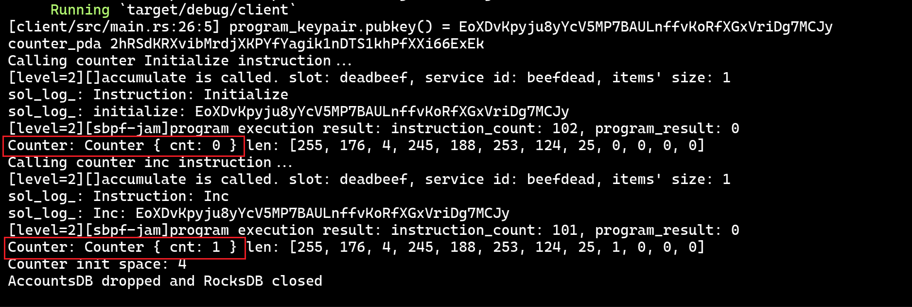

## Overview
This is a prototype of sBPF runtime as a service deployed on PolkaVM.

## How To Test

### Prerequisites

1. Follow [Anchor installation guide](https://www.anchor-lang.com/docs/installation) to install solana and Anchor.
2. Install the `polkatool` cli:

```bash
# clone the polkavm repo:
git clone https://github.com/paritytech/polkavm.git
# build and install polkatool cli
# make sure it will be install under your PATH
cd polkavm/tools/polkatool
cargo install --path .
```

### build the solana counter program

```bash
# In this project root directory:
cd solana-programs/counter
anchor build
```

### build `sbpf-jam`

```bash
cargo xtask build-sbpf
```

### run the client code:
```bash
cargo run -p client
```
And then, you should get the following output:


As you can see, we call the counter program `initialize` and `inc` instruction, and the PDA's data is changed expectedly.

## profiling statistics

| item | value|
| --- | --- |
| compiled binary size | 143KB |
| execution time(initialize instruction) | 377ms |
| execution time(inc instruction) | 379ms |
| memory usage for creating polkavm instance    | 1.6MB |
| peak memory usage for executing initialize instruction | 2.36MB |
| peak memory usage for executing inc instruction | 2.36MB | 

## code structure

```text
project-root/
|-- client/             # client code to send transactions
|-- litesvm/            # our fork of litesvm project with some patches 
|-- sbpf/               # no-std version sbpf
|-- sbpf-jam            # wrapper sbpf as a jam service
|-- sbpf-polkavm        # code for running polkavm
|-- solana-bpf-loader-program # clone from crates.io, replace the sbpf with polkavm
|-- solana-program-runtime    # clone from crates.io, the no-std sbpf would causes this crate to contain a syntax error, thus requiring a slight modification 
|-- solana-programs/    # solana smart contract programs
```

## Implementation details

The core distinction between sBPF and PolkaVM is that sBPF programs can directly access host memory, whereas PolkaVM programs operate within a sandboxed environment and cannot directly interact with host memory. Consequently, when packaging sBPF into a PolkaVM-compatible format, meticulous handling of memory management is required.​

### Execution Flow

To understand how sBPF programs are executed in Solana, refer to the [source code here](https://github.com/anza-xyz/agave/blob/04e3b678efb85a30d3b96ef09a9316983bed6b7d/programs/bpf_loader/src/lib.rs#L1576-L1775).

The process begins by ​serializing parameters into a contiguous memory block​ (`parameter_bytes`) and generating ​address mapping metadata​ (`regions`). This memory block is loaded into the sBPF VM starting at the address `MM_INPUT_START`. The virtual machine will read input data for the program execution from this address.
```Rust
let (parameter_bytes, regions, accounts_metadata) = serialization::serialize_parameters(
        invoke_context.transaction_context,
        instruction_context,
        !direct_mapping,
        mask_out_rent_epoch_in_vm_serialization,
    )?;
```

Proceed to instantiate the virtual machine and execute the program:​
```Rust
create_vm!(vm, executable, regions, accounts_metadata, invoke_context);
...
let (compute_units_consumed, result) = vm.execute_program(executable, !use_jit);
```

During program execution, if the account data is modified, the content of `parameter_bytes` will be ​directly mutated.
Subsequently, `parameter_bytes` undergoes ​deserialization​ to write back modifications to the underlying storage.
```Rust
fn deserialize_parameters(
    invoke_context: &mut InvokeContext,
    parameter_bytes: &[u8],
    copy_account_data: bool,
) -> Result<(), InstructionError> {
    serialization::deserialize_parameters(
        invoke_context.transaction_context,
        invoke_context
            .transaction_context
            .get_current_instruction_context()?,
        copy_account_data,
        parameter_bytes,
        &invoke_context.get_syscall_context()?.accounts_metadata,
    )
}

let mut deserialize_time = Measure::start("deserialize");
let execute_or_deserialize_result = execution_result.and_then(|_| {
    deserialize_parameters(invoke_context, parameter_bytes.as_slice(), !direct_mapping)
        .map_err(|error| Box::new(error) as Box<dyn std::error::Error>)
});
deserialize_time.stop();
```

When transitioning execution to PolkaVM, it is necessary to pass the `elf`, `parameter_bytes`, `regions`, `stack_size`, and `heap_size` to the `sbpf-jam`.
```Rust
let mut polkavm = SbpfPolkaVm::new();
let elf = executable.get_elf_bytes();
let (compute_units_consumed, result) = polkavm.execute_program(
    elf,
    parameter_bytes.as_slice_mut(),
    &regions,
    executable.get_config().stack_size(),
    invoke_context,
);
```

`sbpf-jam` then retrieves the parameters:
```Rust
let jam_params = JamParameters::decode(&mut param_bytes.0.as_slice());
let jam_params = match jam_params {
    Ok(v) => v,
    Err(err) => {
        info!(target = "sbpf-jam", "decode param_bytes fail: {}", err);
        return None;
    }
};

let (elf, new_parameter_bytes, regions) = read_params(&jam_params);
```

Instantiate the sBPF virtual machine instance and execute the program:​
```Rust
let mut loader = BuiltinProgram::new_loader(Config::default());
loader.register_function("log", builtins::Log::vm).unwrap();
register_builtins(&mut loader);
let loader = Arc::new(loader);
let executable = Executable::<JamContextObject>::load_with_backup(elf, loader, false);
if executable.is_err() {
    return None;
}
let executable = executable.unwrap();
let mut ctx_obj = JamContextObject::new(100000, jam_params.invoke_context_ptr);
let mut stack = AlignedMemory::zero_filled(jam_params.stack_size as usize);
let mut heap = AlignedMemory::zero_filled(jam_params.heap_size as usize);
create_vm!(vm, &executable, &mut ctx_obj, stack, heap, regions, None);
let regions = vm.memory_mapping.get_regions();
let (instr_cnt, result) = vm.execute_program(&executable, true);
```

Finally, propagate the program execution results and the modified `parameter_bytes` back to the host via system calls:
```Rust
unsafe {
    imports::export_parameter_bytes(
        new_parameter_bytes.as_slice().as_ptr() as u64,
        new_parameter_bytes.as_slice().len() as u64,
    );
    imports::export_program_result((&result) as *const _ as u64, instr_cnt);
}
```

### Syscalls

Divergent memory access mechanisms​ between sBPF and Polkavm necessitate modifications to SVM system calls. The original workflow—passing guest addresses → converting to host physical addresses → accessing host memory—must be replaced with Polkavm's sandboxed access model. 

For instance, `sol_get_rent_sysvar`'s implementation'：
```Rust
declare_builtin_function!(
    /// Get a Rent sysvar
    SyscallGetRentSysvar,
    fn rust(
        invoke_context: &mut InvokeContext,
        var_addr: u64,
        _arg2: u64,
        _arg3: u64,
        _arg4: u64,
        _arg5: u64,
        memory_mapping: &mut MemoryMapping,
    ) -> Result<u64, Error> {
        get_sysvar(
            invoke_context.get_sysvar_cache().get_rent(),
            var_addr,
            invoke_context.get_check_aligned(),
            memory_mapping,
            invoke_context,
        )
    }
);
fn get_sysvar<T: std::fmt::Debug + Sysvar + SysvarId + Clone>(
    sysvar: Result<Arc<T>, InstructionError>,
    var_addr: u64,
    check_aligned: bool,
    memory_mapping: &mut MemoryMapping,
    invoke_context: &mut InvokeContext,
) -> Result<u64, Error> {
    translate_mut!(
        memory_mapping,
        check_aligned,
        let var: &mut T = map(var_addr)?;
    );
    let sysvar: Arc<T> = sysvar?;
    *var = T::clone(sysvar.as_ref());

    Ok(SUCCESS)
}
```
Requires modification to:​
```Rust
declare_sbpf_builtin! {
    SolGetRentSysvar,
    fn rust(
        handler: InstanceHandler,
        invoke_context: &mut InvokeContext,
        var_addr: u64,
    ) -> () {
        let cost = invoke_context
            .get_execution_cost()
            .syscall_base_cost
            .saturating_add(size_of::<Rent>() as u64);
        invoke_context.consume_checked(cost).unwrap();
        let polkavm_var_addr = handler.map(var_addr, size_of::<Rent>() as u64).unwrap();
        let buffer = invoke_context
            .get_sysvar_cache()
            .sysvar_id_to_buffer(&Rent::id())
            .as_ref()
            .unwrap();
        let mut handler = handler;
        handler.write_memory(polkavm_var_addr as u32, &buffer).unwrap();
    }
}
```

